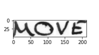
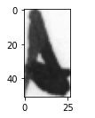
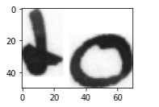
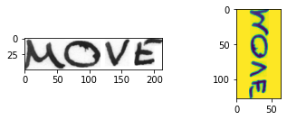
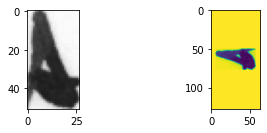
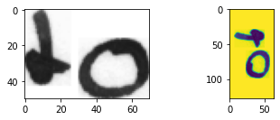
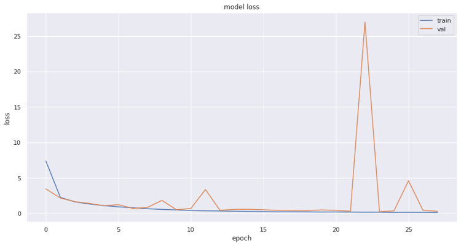
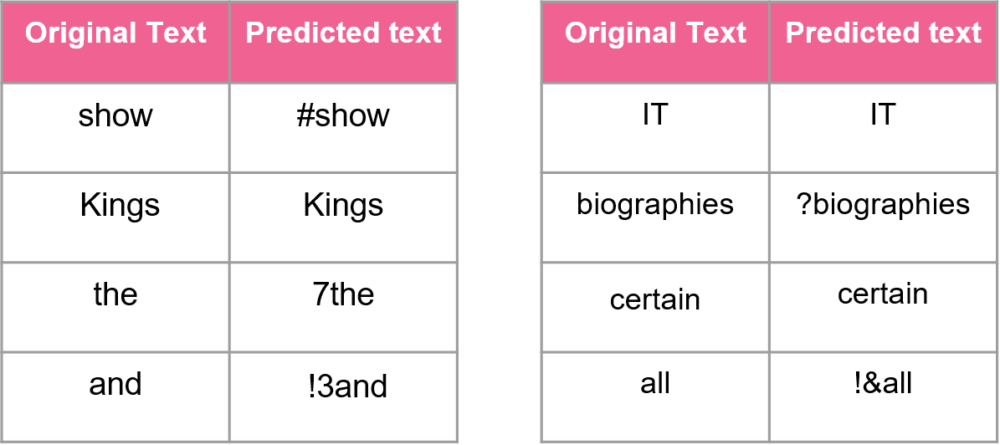

# Optical-Character-Recognition

# Objective
To detect and extract text from the handwritten text images

# Input 
    

# Preprocessing
Rescaling: Scaled the different size images into a fixed size of 128x64x3 using padding 
Converting an image from one colour space to another for better image contrast 
Make sure the values are in the range of 0 to 255 
Normalizing the values in the range of (0,1)

# Preprocessed images
    
     

# Loss

# Predictions
 
